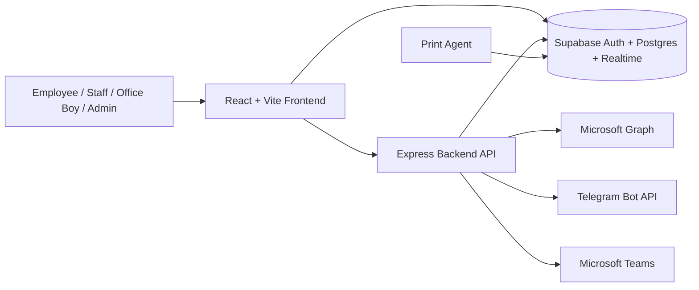
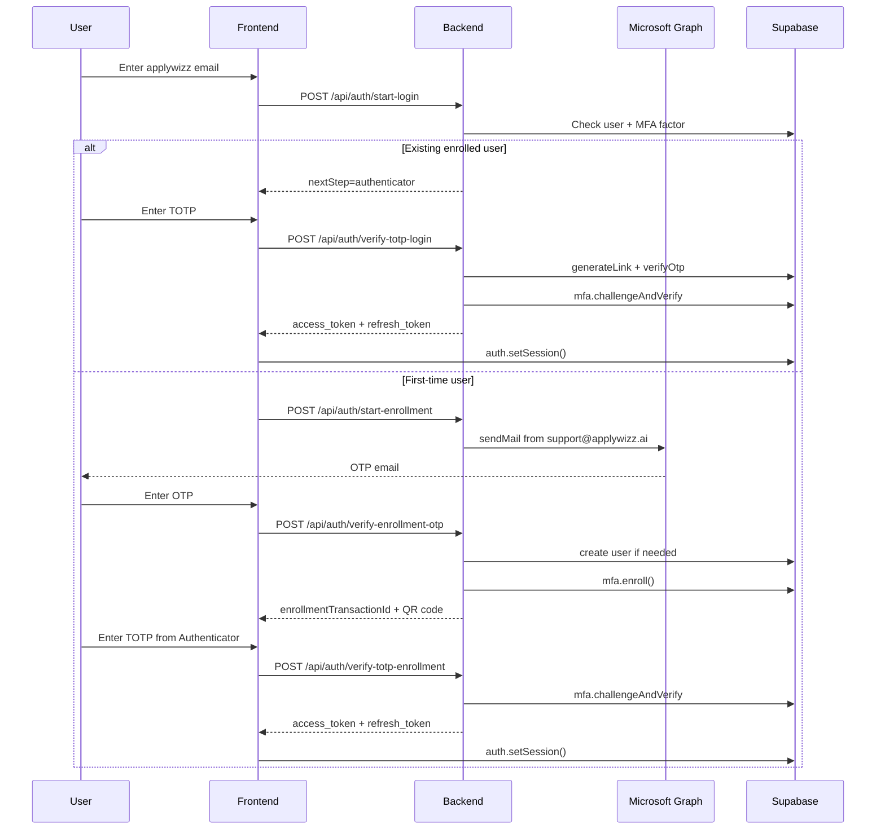
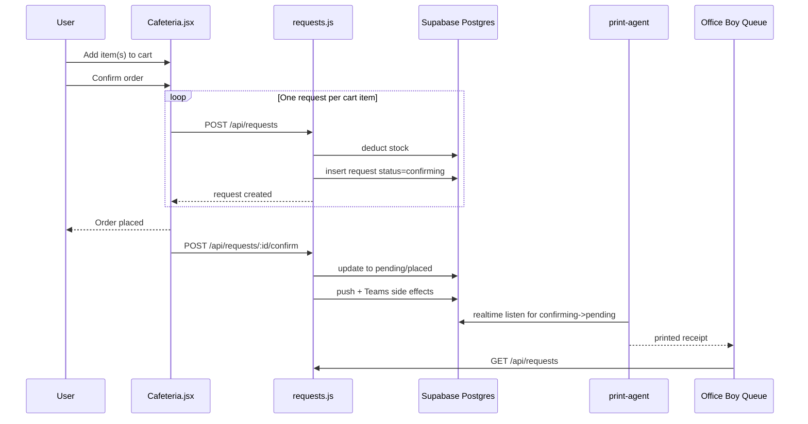
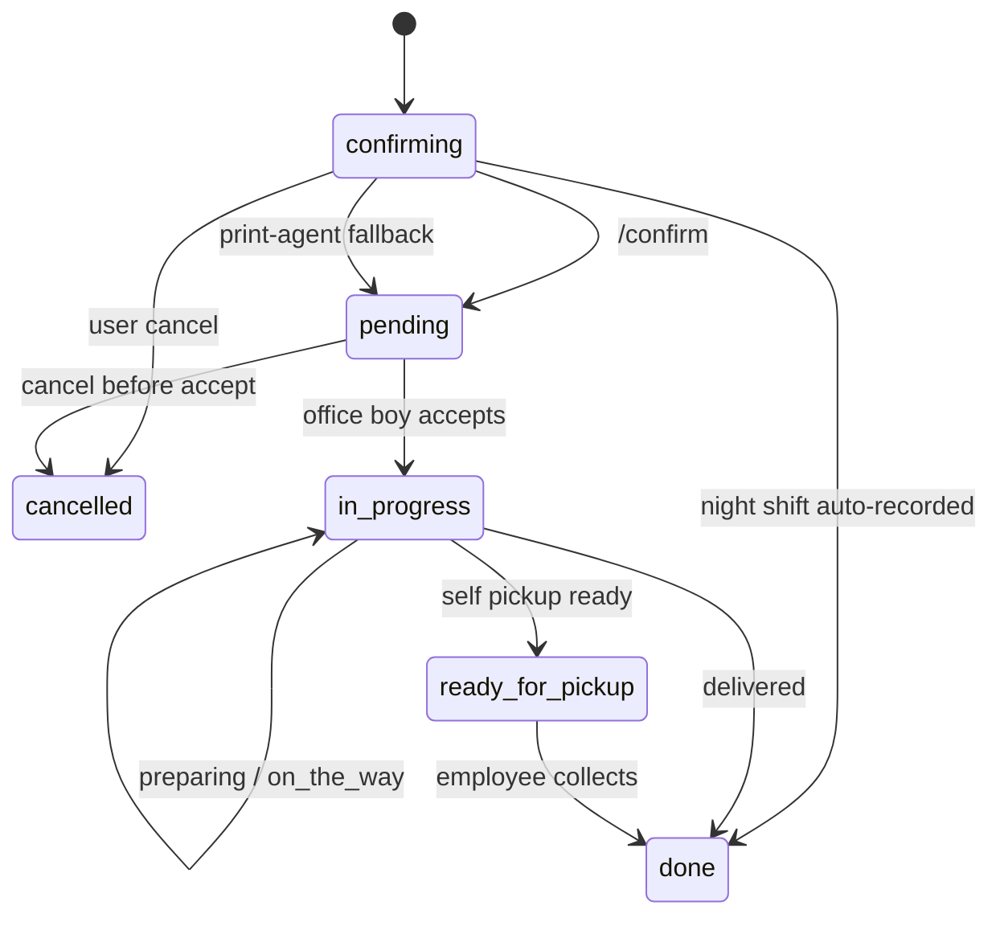
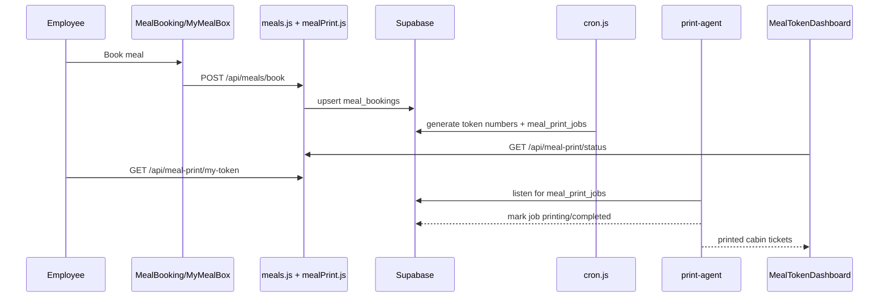
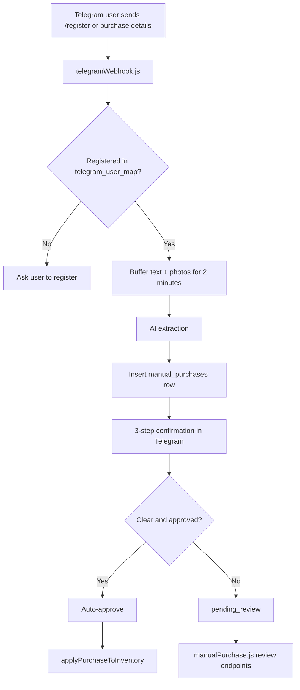

# Snackify Architecture, Workflow, and QA Audit

## A. Executive Summary

Snackify is a React/Vite frontend backed by an Express API and Supabase. The main flows are:

- OTP email for first-time enrollment
- server-side Supabase TOTP MFA
- bearer-token API authorization
- cafeteria order creation with a 30-second `confirming` window
- meal booking with shift-based cutoffs
- a separate print agent that prints orders and meal tokens from Supabase Realtime

The most important proven risks in the current codebase are:

- order creation is multi-request and non-idempotent, so partial success and duplicate submission are real risks
- office-boy visibility depends on orders leaving `confirming`, but the print-agent fallback bypasses backend side effects
- global backend rate limiting plus frontend polling can produce the reported 429s
- onboarding preference state allows contradictory values like `No Snacks` plus real snacks
- reported `Onion` and `Any Other` UI bugs are not present in the active checked-in source, so they need live repro before a code fix

## B. Current Architecture

### Frontend

- Routing and MFA gate live in `frontend/src/App.jsx`.
- Session bootstrap lives in `frontend/src/hooks/useAuth.js`.
- API requests live in `frontend/src/lib/api.js`.
- Main user flows live in:
  - `frontend/src/pages/Login.jsx`
  - `frontend/src/pages/Cafeteria.jsx`
  - `frontend/src/pages/LiveTracking.jsx`
  - `frontend/src/pages/MealBooking.jsx`
  - `frontend/src/pages/MyMealBox.jsx`
  - `frontend/src/pages/MealTokenDashboard.jsx`
  - `frontend/src/pages/RequestQueue.jsx`

### Backend

- Express server wiring lives in `backend/src/server.js`.
- Auth middleware lives in `backend/src/middleware/auth.js`.
- Auth and MFA routes live in `backend/src/routes/auth.js`.
- Order routes live in `backend/src/routes/requests.js`.
- Meal booking lives in `backend/src/routes/meals.js`.
- Meal token status and manual print live in `backend/src/routes/mealPrint.js`.
- Telegram and manual purchase ingestion start in `backend/src/routes/telegramWebhook.js`.

### Database

Supabase schema is migration-driven under `supabase/migrations/`.

Core tables and views used by the current system:

- `profiles`
- `enrollment_otps`
- `enrollment_transactions`
- `login_transactions`
- `requests`
- `v_request_queue`
- `meal_bookings`
- `meal_print_jobs`
- `cafeteria_items`
- `inventory`
- `products`
- `transactions`
- `telegram_user_map`
- `manual_purchases`

## C. UML Diagrams

### 1. High-Level Component Diagram

### 2. Authentication Sequence Diagram

### 3. Order Pipeline Sequence Diagram

### 4. Order State Diagram

### 5. Meal Booking and Ticket Generation Sequence Diagram

### 6. Telegram Manual Purchase Flow

## D. Complete File and Module Map

| Module | Key files | What they do |
| --- | --- | --- |
| Auth / MFA | `frontend/src/pages/Login.jsx`, `frontend/src/components/InactivityLock.jsx`, `frontend/src/hooks/useAuth.js`, `backend/src/routes/auth.js`, `backend/src/lib/otpService.js`, `backend/src/lib/microsoftGraph.js` | Enrollment OTP, TOTP enrollment, TOTP login, reauth, session restore, OTP hashing and email send |
| Customer ordering | `frontend/src/pages/Cafeteria.jsx`, `frontend/src/pages/LiveTracking.jsx`, `backend/src/routes/cafeteria.js`, `backend/src/routes/requests.js` | Customer catalog, cart, quick orders, tracking, stock deduction, request lifecycle |
| Meals | `frontend/src/pages/MealBooking.jsx`, `frontend/src/pages/MyMealBox.jsx`, `frontend/src/pages/MealTokenDashboard.jsx`, `backend/src/routes/meals.js`, `backend/src/routes/mealPrint.js`, `backend/src/routes/cron.js`, `print-agent/index.js` | Shift booking windows, token status, cabin printing, reprints, scheduled print jobs |
| Admin / Ops | `frontend/src/pages/Admin.jsx`, `frontend/src/pages/Dashboard.jsx`, `frontend/src/pages/StaffView.jsx`, `backend/src/routes/admin.js`, `backend/src/routes/reports.js` | User invites, role changes, dashboards, operations views |
| Telegram / manual purchase | `backend/src/routes/telegramWebhook.js`, `backend/src/routes/manualPurchase.js`, `backend/src/lib/applyPurchase.js`, `backend/src/lib/purchaseAI.js` | Registration, purchase extraction, confirmation, approval, finance sync |
| Config / tests | `backend/.env.example`, `frontend/.env.example`, `supabase/config.toml`, `backend/tests/*.js`, `tests/e2e/*.spec.js` | Environment assumptions, local auth rate limits, API tests, E2E flows |

## E. Existing Workflows

### Auth pipeline

- First-time user:
  - `start-login`
  - `nextStep: otp`
  - `start-enrollment`
  - `verify-enrollment-otp`
  - server-side `mfa.enroll()`
  - QR code
  - `verify-totp-enrollment`
  - `supabase.auth.setSession()`

- Existing user:
  - `start-login`
  - `nextStep: authenticator`
  - `verify-totp-login`
  - `supabase.auth.setSession()`

- Refresh and session persistence:
  - `useAuth()` calls `supabase.auth.getSession()` on boot
  - `useAuth()` subscribes to `onAuthStateChange()`

### Order pipeline

- `Cafeteria.jsx` submits cart items one-by-one.
- `requests.js` inserts each request as `status='confirming'`.
- `/api/requests/:id/confirm` moves it to `pending/placed`.
- `print-agent/index.js` has a fallback that force-updates old `confirming` orders directly in DB.

### Meal pipeline

- `meals.js` computes booking windows by shift and time.
- `cron.js` creates meal tokens and `meal_print_jobs`.
- `/api/meal-print/my-token` feeds employee ticket UI.
- `/api/meal-print/status` feeds office-boy cabin print dashboard.
- `print-agent/index.js` prints tokens from Realtime `meal_print_jobs`.

### Telegram pipeline

- `/register` links chat to user.
- purchase text and images are buffered for 2 minutes.
- AI extracts item data.
- purchase enters a 3-step confirmation flow.
- purchase is auto-approved or sent to pending review.
- finance endpoints can approve, reject, clarify, or sync.

## F. Problem-by-Problem Root Cause Analysis

### 1. No Snacks selectable with other snacks

- Files:
  - `frontend/src/pages/Onboarding.jsx`
- Root cause:
  - `toggleArr()` is generic and does not make `none` exclusive.
- Exact fix needed:
  - make `none` mutually exclusive in UI state and saved payload.
- Risk:
  - Medium
- Test:
  - select `No Snacks`, then a snack, and verify only one state survives.

### 2. Onion options wrong

- Files:
  - not found in active checked-in source
- Root cause:
  - no `onion` option or active branch was found in the current scanned frontend/backend files.
- Exact fix needed:
  - reproduce against live UI or identify stale deployed code.
- Risk:
  - Unknown
- Test:
  - capture exact live screen and request payload.

### 3. Any Other breaking drinks page

- Files:
  - not found in active checked-in source
- Root cause:
  - no active `Any Other` string or branch was found in the current checked-in flow.
- Exact fix needed:
  - reproduce from live bundle or identify missing branch/file.
- Risk:
  - Unknown
- Test:
  - capture exact UI action, browser console, and network call.

### 4. 429 after 1.5–2 minutes

- Files:
  - `backend/src/server.js`
  - `frontend/src/pages/LiveTracking.jsx`
- Root cause:
  - backend uses a global limiter of `120` requests per minute
  - tracking page polls every 5 seconds and occasionally loads auxiliary request data
- Exact fix needed:
  - split rate limits by route/user or reduce polling volume.
- Risk:
  - High
- Test:
  - open multiple tracking tabs for 2 minutes and inspect 429 responses.

### 5. Order success shown but order not saved

- Files:
  - `frontend/src/pages/Cafeteria.jsx`
- Root cause:
  - cart submit is a loop of independent POSTs
  - success message is tied to loop completion and last request only
- Exact fix needed:
  - replace with one atomic backend cart endpoint or grouped transaction.
- Risk:
  - High
- Test:
  - order 3 items and force one mid-loop failure.

### 6. Orders not reflecting in office boy dashboard

- Files:
  - `backend/src/routes/requests.js`
  - `print-agent/index.js`
  - `frontend/src/pages/RequestQueue.jsx`
- Root cause:
  - order is not visible in the real queue until it leaves `confirming`
  - print-agent fallback updates DB directly and skips backend side effects
  - queue page is refresh-based
- Exact fix needed:
  - centralize confirmation through one backend path.
- Risk:
  - High
- Test:
  - place order, skip confirm path, inspect queue and notification behavior.

### 7. Duplicate or failed order submission risk

- Files:
  - `frontend/src/pages/Cafeteria.jsx`
- Root cause:
  - no idempotency key
  - multi-item sequential submit
  - no grouped backend order contract
- Exact fix needed:
  - add idempotency and atomic cart submit.
- Risk:
  - High
- Test:
  - double click submit or refresh during submit.

### 8. User logs out on refresh

- Files:
  - `frontend/src/App.jsx`
  - `frontend/src/hooks/useAuth.js`
- Root cause:
  - app requires a restored Supabase session and `aal2`
  - any persistence failure falls back to `/login`
- Exact fix needed:
  - verify hosted Supabase session persistence and remove premature redirect behavior if needed.
- Risk:
  - High
- Test:
  - log in, refresh, inspect local storage and `getSession()`.

### 9. Auth redirects to login after OTP

- Files:
  - `frontend/src/pages/Login.jsx`
  - `backend/src/routes/auth.js`
- Root cause:
  - repo already handles top-level Supabase MFA tokens
  - remaining failure would be stale deployment or session persistence
- Exact fix needed:
  - deploy the MFA token-shape fix and verify `setSession()` persistence.
- Risk:
  - High
- Test:
  - complete enrollment and verify refresh survives.

### 10. Booking meal redirects to login

- Files:
  - `frontend/src/App.jsx`
- Root cause:
  - `/meals` is behind the same `Protected` + `aal2` gate.
- Exact fix needed:
  - same session persistence fix as auth refresh.
- Risk:
  - High
- Test:
  - login, open `/meals`, refresh.

### 11. Meal booking visibility unclear for office boy

- Files:
  - `frontend/src/pages/MealTokenDashboard.jsx`
  - `backend/src/routes/mealPrint.js`
- Root cause:
  - office boy sees cabin print status, not a separate booking management page.
- Exact fix needed:
  - clarify UX or add a dedicated booking summary page if required.
- Risk:
  - Medium
- Test:
  - compare office-boy routes with staff and management routes.

### 12. Telegram bot not working

- Files:
  - `backend/src/routes/telegramWebhook.js`
  - `backend/src/routes/manualPurchase.js`
- Root cause:
  - code path exists
  - actual runtime depends on webhook delivery, env, storage, and sender mapping
  - source alone does not prove outage
- Exact fix needed:
  - verify webhook reachability, bot token, bucket access, and runtime logs.
- Risk:
  - Medium
- Test:
  - send `/register`, then submit a purchase and inspect webhook logs.

## G. Text Wireframes

### Login page

- Purpose:
  - start authentication
- Fields and buttons:
  - email input
  - continue button
- Validation:
  - only `@applywizz.ai`
- Success:
  - moves to OTP or authenticator step
- Failure:
  - inline error

### OTP verification page

- Purpose:
  - verify enrollment email OTP
- Fields and buttons:
  - 6-digit OTP input
  - verify button
- Success:
  - QR setup step
- Failure:
  - stay on page with error

### First-time MFA setup

- Purpose:
  - enroll TOTP
- Fields and buttons:
  - QR code
  - authenticator code input
  - verify button
- Success:
  - session created and user enters app
- Failure:
  - code resets, user retries

### Customer ordering page

- Purpose:
  - browse and place cafeteria orders
- Fields and buttons:
  - category headings
  - item cards
  - add buttons
  - cart sheet
  - location and delivery choice
- Success:
  - requests created and tracking page opens
- Failure:
  - toast or inline error

### Review order page

- Purpose:
  - final submit
- Fields and buttons:
  - cart line items
  - note
  - location
  - submit
- Current limitation:
  - submit is not atomic across multiple cart items

### Order tracking page

- Purpose:
  - live status
- Fields and buttons:
  - progress state
  - cancel action during cancel window
  - queue-ahead indicator
  - refresh/polling status
- Failure behavior:
  - 429 shows busy banner and backoff

### Meal booking page

- Purpose:
  - book lunch/dinner by shift rules
- Fields and buttons:
  - calendar
  - meal choice chips
  - skip button
- Success:
  - booking saved
- Failure:
  - shift cutoff message

### My Meal Box

- Purpose:
  - employee ticket view
- Fields and buttons:
  - token card
  - refresh
  - reprint when available
- Pending behavior:
  - shows `Token pending` until generation/printing path has happened

### Office Boy dashboard

- Purpose:
  - cabin-wise token printing
- Fields and buttons:
  - cabin cards
  - counts
  - print/reprint actions
  - search and refresh

### Admin dashboard

- Purpose:
  - user and operations management
- Fields and buttons:
  - invite user
  - role updates
  - reporting and operations links

### Telegram notification flow

- Purpose:
  - submit manual purchases through chat
- Steps:
  - register
  - send purchase details
  - confirm item name, quantity, and price
  - auto-approve or wait for reviewer

## H. Manual Testing Checklist

- Fresh signup with a new `@applywizz.ai` email
- OTP login for an existing enrolled user
- Refresh after login
- Place one snack order
- Place a three-item order
- Select `No Snacks` plus another snack and verify current contradiction
- Test self-pickup
- Cancel within 30 seconds
- Keep tracking open for more than 2 minutes
- Book meal before and after cutoff
- Open My Meal Box before and after token assignment
- Test manual cabin print from Meal Token Dashboard
- Test `/register` and manual purchase submission in Telegram
- Verify office boy queue updates

## I. SDLC Architecture Review

### Requirement Analysis

- Current state:
  - the product has working core flows
- Missing:
  - clear invariants for cart atomicity
  - clear ownership of order confirmation
  - clear polling budgets

### Design

- Current state:
  - simple React + Express + Supabase split
- Missing:
  - some workflow state is duplicated between frontend, backend, and print-agent

### Development

- Current state:
  - patterns are consistent and maintainable
- Missing:
  - idempotency
  - centralized state transitions
  - better observability hooks

### Testing

- Current state:
  - auth tests and some E2E coverage exist
- Missing:
  - multi-item cart atomicity tests
  - sustained 429 tests
  - Telegram runtime verification tests

### Deployment

- Current state:
  - environment-driven config exists
- Missing:
  - stronger deployment verification around auth URL, session persistence, Telegram, and Graph

### Monitoring

- Current state:
  - minimal
- Missing:
  - structured logs and traces for confirm, print, and Telegram flows

### Maintenance

- Current state:
  - migration history is readable
- Missing:
  - cleanup of confusing legacy paths like `print-agent/agent.js`

## J. Recommended Fix Priority

1. Order atomicity and idempotency
2. Queue consistency and confirmation path ownership
3. Session persistence and refresh regressions
4. 429 mitigation on tracking routes
5. Onboarding sentinel exclusivity such as `No Snacks`
6. Telegram runtime verification and observability
7. Only after repro: `Onion` and `Any Other`

## K. Future Enhancements

- realtime queue updates
- idempotent grouped orders
- audit logs for order transitions
- Telegram retry queue
- route-level rate limiting
- better error telemetry
- staging environment
- stronger E2E coverage for auth refresh and multi-item orders

## L. Final Roadmap

- Stabilize auth and session persistence first.
- Make cart submit atomic and idempotent.
- Route every order confirmation through backend logic instead of direct DB fallback updates.
- Reduce polling pressure and split backend limiter policy.
- Clean onboarding sentinel values.
- Reproduce unresolved live-only UI bugs before editing code.

## M. Status of This Document

- This document is based on the checked-in project files that were inspected.
- It is an architecture and QA report only.
- No application code, pipeline logic, environment values, or database data were changed to produce it.
